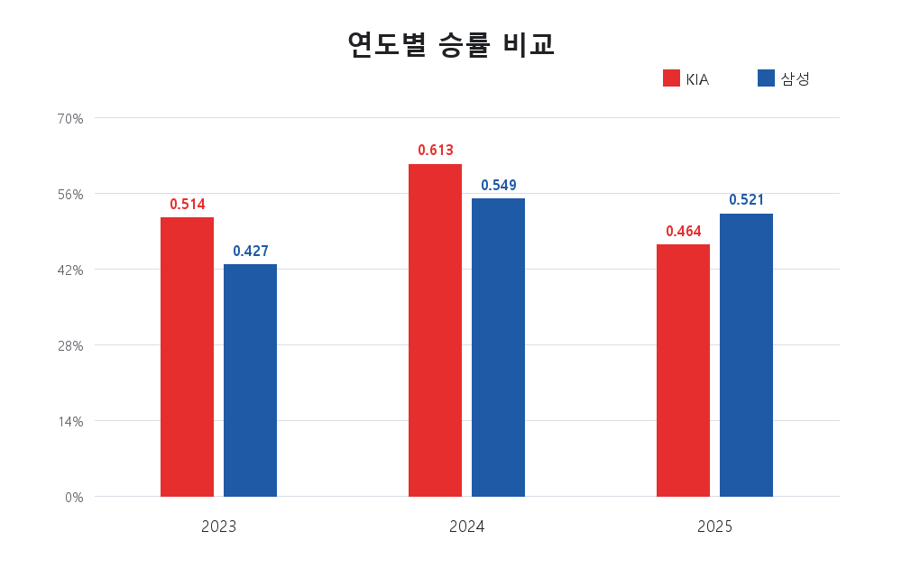
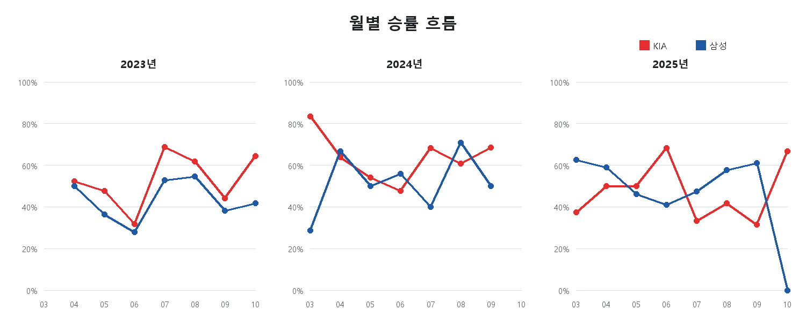
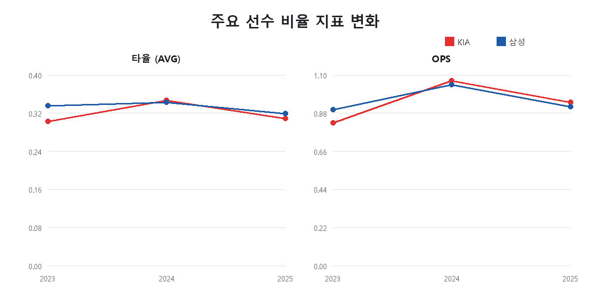
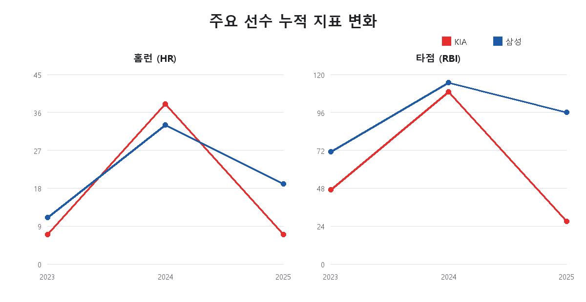
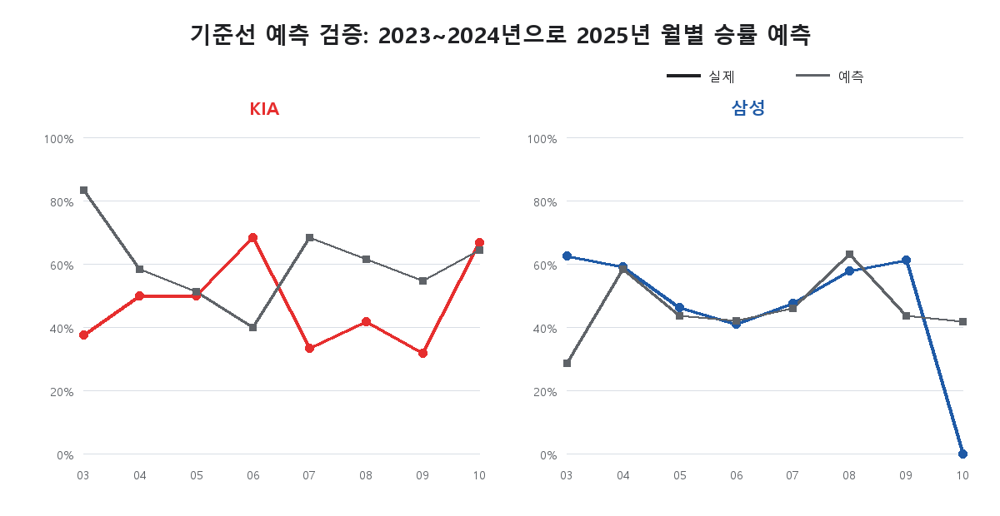
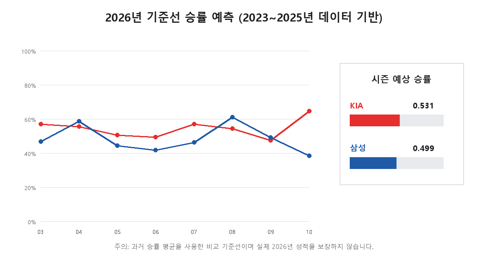

# KIA 타이거즈 vs 삼성 라이온즈
# 2023~2025 시즌 데이터 기반 성적 트렌드 분석

## 1. 분석 주제 및 선정 이유

KIA 타이거즈와 삼성 라이온즈의 2023~2025년 정규시즌 경기 결과를 비교했다. 시즌 전체 성적뿐 아니라 월별 흐름과 주요 선수 기록을 함께 살펴, 두 팀의 성적 변화가 언제 나타났는지 확인하는 것이 목표다.

## 2. 분석 질문

1. 2023~2025년 두 팀의 시즌 성적은 어떻게 변화했는가?
2. 두 팀은 시즌 중 어느 달에 상대적으로 강하거나 약했는가?
3. 주요 선수 구자욱과 김도영의 기록은 시즌별로 어떻게 변화했는가?

## 3. 데이터 설명

- 기간: 2023~2025년 KBO 정규시즌
- 대상: KIA 타이거즈, 삼성 라이온즈
- 원본 데이터: 968행 (완료 경기 864행, 미완료·취소 일정 104행)
- 분석 데이터: 완료된 경기만 남긴 팀-경기 기준 864행
- 선수 데이터: 구자욱·김도영의 시즌별 정규시즌 기록 6행

한 경기는 두 팀의 관점에서 각각 한 행으로 저장한다. 따라서 각 팀은 시즌별 144경기, 두 팀을 합치면 시즌별 288행이다.

## 4. 데이터 수집 방법

`collect_games.py`가 KBO 공식 홈페이지의 경기일정 데이터를 월 단위로 요청하고, KIA와 삼성의 경기만 추출했다. `--all-seasons` 옵션으로 2023 ~ 2025년 3~10월 정규시즌을 수집했다. 원본에는 아직 끝나지 않았거나 취소된 일정도 보존하기 위해 `status` 값을 함께 저장했다.

## 5. 데이터 전처리

`preprocess_games.py`는 `status`가 `completed`인 행만 분석 대상으로 사용했다. 날짜, 팀, 상대 팀, 홈·원정, 득점, 결과를 정리하고 다음 검증을 수행했다.

- 팀-경기 조합 중복 여부: 중복 0건
- 필수 값 누락 여부: 누락 0건
- `win`, `loss`, `draw`, `run_diff` 계산값 검증
- 큰 점수 차 경기 47건을 이상치 후보로 표시했지만, KBO 경기센터 표본 대조 결과 실제 경기 결과이므로 삭제하지 않음

## 6. 분석 방법

- 연도별 분석: 승률을 `승 / (승 + 패)`로 계산했다. 무승부는 분모에서 제외했다.
- 월별 분석: 같은 기준으로 월별 승률을 계산했다. 경기가 없는 달은 0%가 아니라 자료 없음으로 표시했다.
- 최근 10경기 분석: 각 팀·시즌 안에서 최근 10경기의 승률을 계산했다. 첫 9경기는 10경기 창이 완성되지 않아 해석에서 제외했다.
- 선수 기록 분석: AVG, HR, RBI, OPS를 시즌별로 비교했다. OPS는 KBO 공식 표의 출루율과 장타율을 더해 계산했다.
- 보너스 기준선 예측: 과거 같은 달의 승·패를 합산한 승률을 다음 시즌 같은 달의 예측값으로 사용했다. 복잡한 예측 모델이 아니라, 미래 예측의 기준점으로 쓰는 단순 방법이다.

## 7. 시각화 및 결과

### 7.1 연도별 승률

| 시즌 | KIA (승-패-무, 승률) | 삼성 (승-패-무, 승률) |
|---|---:|---:|
| 2023 | 73-69-2, 0.514 | 61-82-1, 0.427 |
| 2024 | 87-55-2, 0.613 | 78-64-2, 0.549 |
| 2025 | 65-75-4, 0.464 | 74-68-2, 0.521 |

### 7.2 월별 승률 흐름

2024년 KIA는 4월 0.640, 7월 0.682, 9월 0.684로 여러 달에서 높은 승률을 보였다. 삼성은 같은 해 4월 0.667, 8월 0.708이 높았고 7월은 0.400이었다. 2025년 KIA는 6월 0.682 뒤 7월 0.333, 9월 0.316으로 낮아졌고, 삼성은 4월 0.591·8월 0.577·9월 0.611을 기록했다.

### 7.3 주요 선수 기록

| 선수 | 시즌 | 경기 | AVG | HR | RBI | OPS |
|---|---:|---:|---:|---:|---:|---:|
| 구자욱 | 2023 | 119 | 0.336 | 11 | 71 | 0.901 |
| 구자욱 | 2024 | 129 | 0.343 | 33 | 115 | 1.044 |
| 구자욱 | 2025 | 142 | 0.319 | 19 | 96 | 0.918 |
| 김도영 | 2023 | 84 | 0.303 | 7 | 47 | 0.824 |
| 김도영 | 2024 | 141 | 0.347 | 38 | 109 | 1.067 |
| 김도영 | 2025 | 30 | 0.309 | 7 | 27 | 0.943 |

### 7.4 보너스: 기준선 예측 검증 및 2026년 예측

먼저 2023~2024년 데이터만 사용하여 2025년 월별 승률을 예측하고 실제값과 비교했다. 예측값은 같은 달의 과거 승·패를 합산해 계산했다. 2025년 월별 평균 절대오차(MAE)는 KIA 0.204, 삼성 0.131이었다.

이 검증 뒤 2023~2025년 전체 데이터를 사용하여 2026년 기준선 승률을 계산했다.

| 팀 | 학습 기간 | 2026년 기준선 승률 예측 | 계산 기준 |
|---|---|---:|---|
| KIA | 2023~2025 | 0.531 | 세 시즌 전체 225승 199패의 합산 승률 |
| 삼성 | 2023~2025 | 0.499 | 세 시즌 전체 213승 214패의 합산 승률 |

이 수치는 2026년 실제 기록을 사용하지 않은 사전 기준선 예측이다. 특히 KIA의 2025년 월별 오차가 큰 점에서 알 수 있듯이, 선수 구성·부상·일정·상대 전력처럼 이 데이터에 없는 요인을 반영하지 못한다. 따라서 실제 성적을 단정하는 용도가 아니라, 이후 더 복잡한 모델과 비교할 출발점으로 해석한다.

## 8. 인사이트

### Insight 1. KIA와 삼성의 시즌 성적 변화 방향은 달랐다.

- Fact: KIA 승률은 2023년 0.514에서 2024년 0.613으로 상승한 뒤 2025년 0.464로 하락했다. 삼성은 0.427에서 0.549로 상승했고, 2025년에도 0.521을 유지했다.
- Interpretation: KIA의 2024년 성적은 세 시즌 중 가장 좋았지만 그 흐름이 2025년까지 이어지지는 않았다. 삼성은 2023년의 낮은 승률을 개선한 뒤 2025년에도 5할 이상의 시즌 성적을 냈다.

### Insight 2. 월별 성적은 시즌 전체 승률만으로 보이지 않는 흐름을 보여 준다.

- Fact: 2024년 KIA는 4월·7월·9월에 모두 0.640 이상을 기록했다. 삼성은 2024년 4월 0.667, 8월 0.708로 높았지만 7월은 0.400이었다. 2025년 KIA는 6월 0.682에서 7월 0.333, 9월 0.316으로 내려갔다.
- Interpretation: KIA의 2024년은 높은 승률이 여러 달에 걸쳐 나타난 시즌이었다. 반대로 2025년은 중반 이후 낮은 월별 승률이 누적되며 최종 승률 하락으로 이어진 모습이다. 다만 월별 승률만으로 그 원인을 단정할 수는 없다.

### Insight 3. 두 선수 모두 2024년에 가장 높은 주요 타격 지표를 기록했다.

- Fact: 구자욱은 2024년 AVG 0.343, HR 33, RBI 115, OPS 1.044를 기록했고, 김도영은 AVG 0.347, HR 38, RBI 109, OPS 1.067을 기록했다. 두 선수의 세 시즌 중 각 지표 최고값은 모두 2024년에 나왔다.
- Interpretation: 두 팀의 2024년 높은 팀 승률과 두 선수의 좋은 기록은 같은 시기에 관찰된다. 그러나 선수 한 명의 기록만으로 팀 성적의 원인이라고 결론내릴 수는 없다. 특히 김도영의 2025년은 30경기 자료이므로 누적 HR·RBI를 144경기 시즌과 직접 비교하면 안 된다.

## 9. 결론

두 팀은 2024년에 모두 전년보다 높은 승률을 기록했지만, 2025년에는 KIA가 하락하고 삼성이 상대적으로 안정적인 흐름을 보였다. 월별 분석은 특히 KIA의 2024년 다수 강세 구간과 2025년 7~9월 하락 구간을 확인하게 해 준다. 선수 비교에서는 구자욱과 김도영 모두 2024년에 가장 높은 주요 타격 지표를 기록했다.

## 10. 한계점

- 분석 대상은 두 팀과 두 명의 타자에 한정되어 있다.
- 월별 경기 수가 서로 달라 짧은 달의 승률은 변동이 클 수 있다.
- 최근 10경기 승률은 흐름을 보여 주지만 미래 성적을 예측하지는 않는다.
- 선수 기록은 팀 성적과 함께 관찰한 결과이며, 인과관계를 증명하지 않는다.
- 김도영의 2025년 기록은 30경기 기준이라 시즌 누적 기록 비교에 제한이 있다.
- 2026년 예측은 세 시즌의 과거 승률만 사용한 단순 기준선이다. 학습 기간이 짧고 외부 변수를 반영하지 않아 실제 결과를 보장하지 않는다.

## 11. AI 사용 로그

- 사용 작업: 프로젝트 구조·수집·전처리·분석·시각화 코드 작성 보조, 오류 원인 분석, 보고서 문장 초안 작성
- 사용 이유: 반복적인 코드 작성 시간을 줄이고 여러 분석 방법을 검토하기 위해 AI를 활용했다. 다만 데이터 선택, 분석 질문, 결과 해석의 최종 판단은 작성자가 수행했다.
- 검증 방법: KBO 공식 경기센터 표본, KBO 공식 역대 구단성적, KBO 공식 선수 기록과 수집·집계 결과를 대조
- 최종 판단: 수치와 해석을 분리하고, 모든 해석은 생성된 CSV와 그래프를 다시 확인해 작성

## 12. 데이터 출처 및 참고사항

- KBO 공식 경기일정 및 경기센터: <https://www.koreabaseball.com/Schedule/GameCenter/Main.aspx>
- KBO 공식 역대 구단성적: <https://www.koreabaseball.com/Record/History/Team/Record.aspx>
- 구자욱 공식 선수 기록: <https://www.koreabaseball.com/Record/Player/HitterDetail/Total.aspx?playerId=62404>
- 김도영 공식 선수 기록: <https://www.koreabaseball.com/Record/Player/HitterDetail/Total.aspx?playerId=52605>
